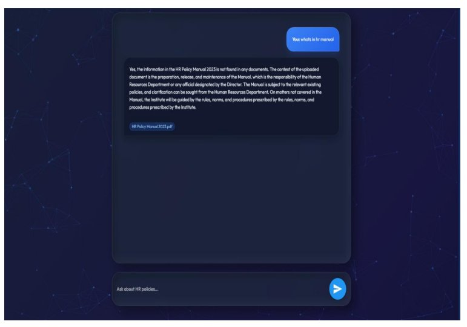
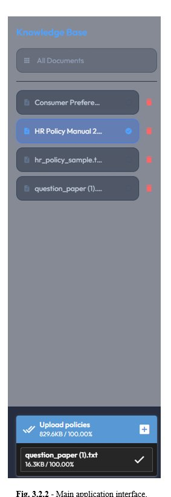

<div align="center">


<br/>

[](https://python.org)
[](https://fastapi.tiangolo.com)
[](https://langchain.com)
[](https://faiss.ai)
[](https://ollama.ai)
[](https://nicegui.io)
[](LICENSE)
[]()

<br/>

> **🔒 Zero cloud. Zero hallucinations. Zero privacy risk.**
>
> *An intelligent offline AI chatbot that answers questions directly from your organizational documents — running entirely on your machine.*

<br/>

[](https://github.com/Abhinxvsharma/INTRABOT---Domain-Specific-Chatbot/stargazers)
[](https://github.com/Abhinxvsharma/INTRABOT---Domain-Specific-Chatbot/network)

</div>

---

## 📸 Screenshots

<div align="center">

### 💬 Chat Interface



*Query your HR documents in natural language — every answer grounded strictly in your uploaded files*

<br/>

### 📁 Knowledge Base Sidebar



*Upload PDFs, DOCX, TXT, CSV — switch between documents or query all at once*

</div>

---

## 🧠 What is IntraBot?

**IntraBot** is a **Retrieval-Augmented Generation (RAG)** powered chatbot built for enterprise use. Upload internal documents — HR policies, employee handbooks, leave guides — and ask questions in plain English, getting **precise, grounded answers without sending your data to any cloud service**.

```
User asks:  "How many sick leaves am I entitled to?"

IntraBot:   📂 Searches YOUR uploaded HR docs
            ✂️  Finds top-3 relevant chunks via FAISS
            📝 Builds prompt with context + question
            🤖 Local LLM generates grounded answer
            ✅ Returns accurate, document-based response
```

### Why IntraBot over ChatGPT / cloud AI?

| Feature | ❌ Cloud AI | ✅ IntraBot |
|---|---|---|
| Data Privacy | Sent to external servers | Stays on your machine |
| Hallucinations | Makes up answers | Grounded in your docs only |
| Internet Needed | Yes, always | 100% Offline |
| Cost | Subscription / API fees | Free & Open Source |
| Domain Accuracy | Generic responses | From your actual policies |

---

## ✨ Key Features

```
🔒  100% Offline        →  No data ever leaves your machine
🧠  RAG Architecture    →  Retrieve first, then generate — grounded answers
🚫  Hallucination Guard →  LLM answers ONLY from retrieved document context
⚡  Query Caching       →  Repeated questions answered in <50ms from cache
📄  Multi-Format        →  PDF · DOCX · TXT · CSV — all formats supported
🎯  Per-Doc Filtering   →  Query all docs or target one specific file
🌐  REST API            →  Clean FastAPI endpoints for external integrations
🎨  Modern UI           →  NiceGUI Claymorphism interface with Aurora animations
```

---

## 🏗️ Architecture

```
╔══════════════════════════════════════════════════════════════════╗
║                 📥 DOCUMENT INGESTION PIPELINE                    ║
╠══════════════════════════════════════════════════════════════════╣
║  📄 Upload → 🔍 Extract Text → ✂️ Chunk (300 chars) → 🔢 Embed   ║
║                                          ↓                        ║
║                                   💾 FAISS Vector DB              ║
╚══════════════════════════════════════════════════════════════════╝
                                          ↕
╔══════════════════════════════════════════════════════════════════╗
║                   ❓ QUERY ANSWERING PIPELINE                     ║
╠══════════════════════════════════════════════════════════════════╣
║  ❓ Query → 🔢 Embed → 🔍 FAISS Search → 📋 Top-K Chunks         ║
║       ↓                                          ↓               ║
║  ⚡ Cache? ←──────── 📝 Build RAG Prompt ────────                 ║
║       ↓                        ↓                                 ║
║  💬 Answer ←────── 🤖 Ollama (TinyLlama / Phi-3)                 ║
╚══════════════════════════════════════════════════════════════════╝
```

### Project Structure

```
intrabot/
│
├── 📄 app/
│   ├── main.py                  ← FastAPI entry point + API routes
│   ├── services/
│   │   ├── ingestion.py         ← Document loading + chunking pipeline
│   │   ├── vector_store.py      ← FAISS index management
│   │   └── rag_service.py       ← RAG query + hallucination prevention
│   └── utils/
│       ├── config.py            ← All configuration constants
│       ├── embeddings.py        ← Singleton embedding model loader
│       └── cache_utils.py       ← MD5-keyed JSON response cache
│
├── 📂 data/                     ← Uploaded documents  [gitignored]
├── 📂 vectorstore/              ← FAISS index files   [gitignored]
├── 📂 cache/                    ← Cached responses    [gitignored]
│
├── requirements.txt
├── .gitignore
└── README.md
```

---

## 🛠️ Tech Stack

| Layer | Technology | Purpose |
|---|---|---|
| **Language** | Python 3.10+ | Core backend |
| **Backend API** | FastAPI + Uvicorn | REST endpoints |
| **Frontend UI** | NiceGUI | Python-first web interface |
| **RAG Pipeline** | LangChain | Doc loaders, chunking, retrieval |
| **Embeddings** | Sentence Transformers `all-MiniLM-L6-v2` | 384-dim semantic vectors |
| **Vector DB** | FAISS (Facebook AI) | Local similarity search |
| **LLM Runtime** | Ollama | Local model inference |
| **Models** | TinyLlama 1.1B · Phi-3 3.8B | Answer generation |

---

## 🚀 Getting Started

### Prerequisites

- Python **3.10+**
- [Ollama](https://ollama.ai) installed and running
- **8 GB RAM** minimum (16 GB recommended)
- ~5 GB free disk space

### Installation

```bash
# Clone the repository
git clone https://github.com/Abhinxvsharma/INTRABOT---Domain-Specific-Chatbot.git
cd INTRABOT---Domain-Specific-Chatbot

# Create virtual environment
python -m venv myenv
myenv\Scripts\activate        # Windows
source myenv/bin/activate     # macOS/Linux

# Install dependencies
pip install -r requirements.txt

# Pull a local LLM
ollama pull tinyllama          # Lightweight (recommended)
ollama pull phi3               # Better quality
```

### Run

```bash
# Terminal 1 — Backend
uvicorn app.main:app --reload --port 8000

# Terminal 2 — Frontend
python app/ui/main_ui.py
```

Open `http://localhost:8080` in your browser 🎉

---

## ⚙️ Configuration

```python
# app/utils/config.py

CHUNK_SIZE            = 300    # Characters per chunk
CHUNK_OVERLAP         = 45     # 15% overlap
LLM_MODEL             = "tinyllama:latest"   # or "phi3"
TEMPERATURE           = 0.7
RETRIEVAL_TOP_K       = 3      # Chunks passed to LLM
SIMILARITY_THRESHOLD  = 0.4    # Min similarity score
```

---

## 🔌 API Reference

### Upload Documents
```bash
curl -X POST "http://localhost:8000/upload" \
     -F "files=@HR_Policy.pdf"
```

### Query
```bash
curl -X POST "http://localhost:8000/query" \
  -H "Content-Type: application/json" \
  -d '{"query": "How many sick leaves do I get?", "document_name": null}'
```

```json
{
  "answer": "Employees are entitled to 10 days of paid sick leave...",
  "sources": ["HR_Policy_Manual.pdf"]
}
```

---

## 🚫 Hallucination Prevention

```python
template = """
You are IntraBot, a local HR assistant.
Use ONLY the following context to answer.
If the answer is NOT in the context, say EXACTLY:
"Information not found in documents"
Do NOT hallucinate. Do NOT use external knowledge.

Context: {context}
Question: {question}
Answer:"""
```

---

## 🧪 Test Results

| Test Case | Result |
|---|---|
| PDF Upload | ✅ Pass |
| DOCX Upload | ✅ Pass |
| Semantic Query | ✅ Pass |
| Unknown Question → Fallback | ✅ Pass |
| Repeated Query → Cache | ✅ Pass |
| Offline (no internet) | ✅ Pass |
| REST API Query | ✅ Pass |

---

## 🔮 Future Enhancements

- [ ] 🔐 Role-based multi-user authentication
- [ ] 📷 OCR for scanned PDFs
- [ ] 🎙️ Voice input / text-to-speech
- [ ] 📊 Admin analytics dashboard
- [ ] 🌍 Multilingual document support
- [ ] 🦙 Llama-3 / Mistral-7B / DeepSeek support
- [ ] 🏢 SharePoint / Confluence / HRMS integration
- [ ] 📱 Mobile application

---

## 👨‍💻 Author

<div align="center">


### Abhinav Sharma

*Passionate about building AI/ML solutions that make a real-world impact 🚀*

[](https://www.linkedin.com/in/abhinav-sharma-a73981382/)
[](https://github.com/Abhinxvsharma)

B.Tech CSE — Rayat Bahra Institute of Engineering & Nano-Technology, Hoshiarpur

</div>

---

## 📄 License

This project is licensed under the **MIT License** — feel free to use, modify, and distribute.

---

<div align="center">


**⭐ If IntraBot helped you, please give it a star! ⭐**

*Built with ❤️ using Python · LangChain · FAISS · Ollama · FastAPI*

</div>
